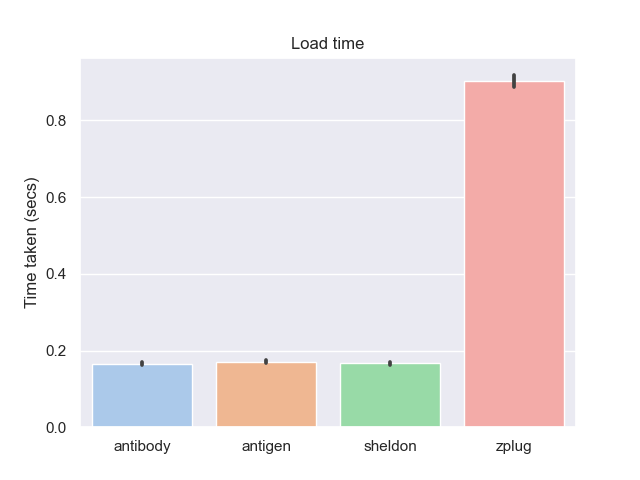

# zsh-plugin-manager-benchmark

Benchmark different Zsh plugin managers.

### Summary of the results

- [antibody], [antigen], and [sheldon] all have excellent performance in both
  install time and load time.
- [zgen] is on par with the above when it comes to load time, but doesn't seem
  to do installation in parallel.
- [zplug] and [zpm] have notably bad load time performance.

## Features

- The following plugin managers are benchmarked: [antibody], [antigen],
  [sheldon], [zgen], [zinit], [zplug], [zpm]. (If you would like to add a new
  plugin manager feel free to open an issue and/or pull request.)
- For each plugin manager the *install* time and the *load* time was tested
  - install time is the the time taken on the first time loading `~/.zshrc`
    until a prompt appears.
  - load time is the time taken for each subsequent load of the `~/.zshrc` until
    a prompt appears.
- 26 of some of the most popular plugins (by GitHub stars) listed in [Awesome
  Zsh Plugins](https://github.com/unixorn/awesome-zsh-plugins/) were used as as
  test case. See [plugins.txt](./src/plugins.txt). The plugins were extracted
  using [awesome-star-count].
- [hyperfine] was used as a benchmarking tool. All benchmarks were run on a
  quiet cloud VM.

[awesome-star-count]: https://github.com/rossmacarthur/awesome-star-count
[hyperfine]: https://github.com/sharkdp/hyperfine

## Results

### Install time


Although install time is not as important as load time it is probably at least
worth doing the install in parallel. From these results its very clear which
plugin managers install in parallel vs sequential.

### Load time



This is the metric we care about most because its about the time it takes to
open a new shell until we get a usable prompt.

**Note:** no deferred loading of plugins was done. For example: many plugin
managers can be used in conjunction with [zsh-defer]. Or [zinit] could be run
using `wait` which defers the plugin loading until after a prompt.

### Details

#### Host
- Vultr.com
- Ubuntu 20.04
- 4 CPU
- 8192 MB RAM

#### Versions
- [antibody] v6.1.1
- [antigen] v2.2.2
- [sheldon] v0.6.3
- [zgen] master @ 0b669d2
- [zinit] master @ 044ba6d4
- [zplug] master @ c4dea76
- [zpm] master @ 0daa697

[antibody]: https://github.com/getantibody/antibody
[antigen]: https://github.com/zsh-users/antigen
[sheldon]: https://github.com/rossmacarthur/sheldon
[zgen]: https://github.com/tarjoilija/zgen
[zinit]: https://github.com/zdharma/zinit
[zplug]: https://github.com/zplug/zplug
[zpm]: https://github.com/zpm-zsh/zpm
[zsh-defer]: https://github.com/romkatv/zsh-defer

## Usage

To benchmark the 'install' step run the following.
```sh
./bench.sh install
```

To benchmark the 'load' step run the following.
```sh
./bench.sh load
```

These commands will output results to `results/`. You can then create charts
from these results using the following.

First install Python dependencies.

```
pip3 install seaborn pandas
```

```sh
./chart.py install
```

or

```sh
./chart.py load
```

## License

Licensed under either of

- Apache License, Version 2.0 ([LICENSE-APACHE](LICENSE-APACHE) or
  http://www.apache.org/licenses/LICENSE-2.0)
- MIT license ([LICENSE-MIT](LICENSE-MIT) or http://opensource.org/licenses/MIT)

at your option.
