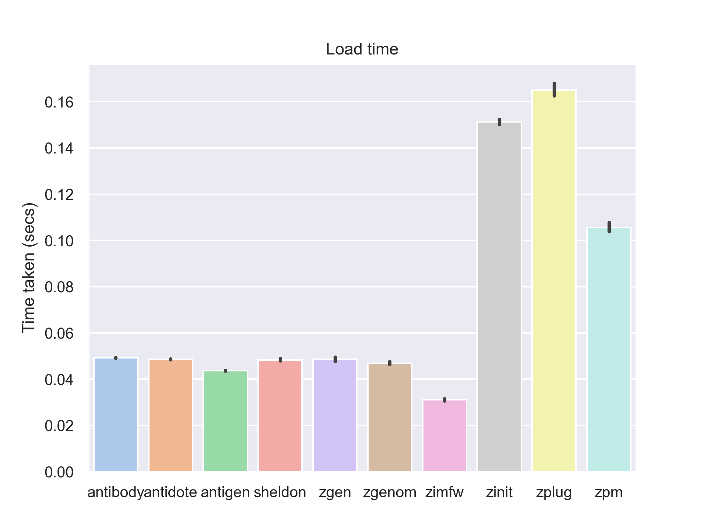

# zsh-plugin-manager-benchmark

Benchmark different Zsh plugin managers.

The plugins used for benchmarking were extracted using
[awesome-star-count](https://github.com/rossmacarthur/awesome-star-count). They
are 26 of the most popular plugins (by GitHub stars) listed in [Awesome Zsh
Plugins](https://github.com/unixorn/awesome-zsh-plugins/). See
[plugins.txt](./src/plugins.txt).

## Usage

To benchmark the 'install' step run the following.
```sh
./bench.sh install
```

To benchmark the 'load' step run the following.
```sh
./bench.sh load
```

These commands will output results to `results/`. You can then create charts
from these results using the following.

```sh
./chart.py install
```

or

```sh
./chart.py load
```

## Results




### Details

Tested on
- Vultr.com
- Ubuntu 20.04
- 4 CPU
- 8192 MB RAM

Versions
- Antibody (version 6.1.0)
- Antigen (version 2.2.2)
- Sheldon (version 0.5.3)
- Zplug (master @ c4dea766566b168a32dbfa8d10335e525ce39fcc)

## License

Licensed under either of

- Apache License, Version 2.0 ([LICENSE-APACHE](LICENSE-APACHE) or
  http://www.apache.org/licenses/LICENSE-2.0)
- MIT license ([LICENSE-MIT](LICENSE-MIT) or http://opensource.org/licenses/MIT)

at your option.
