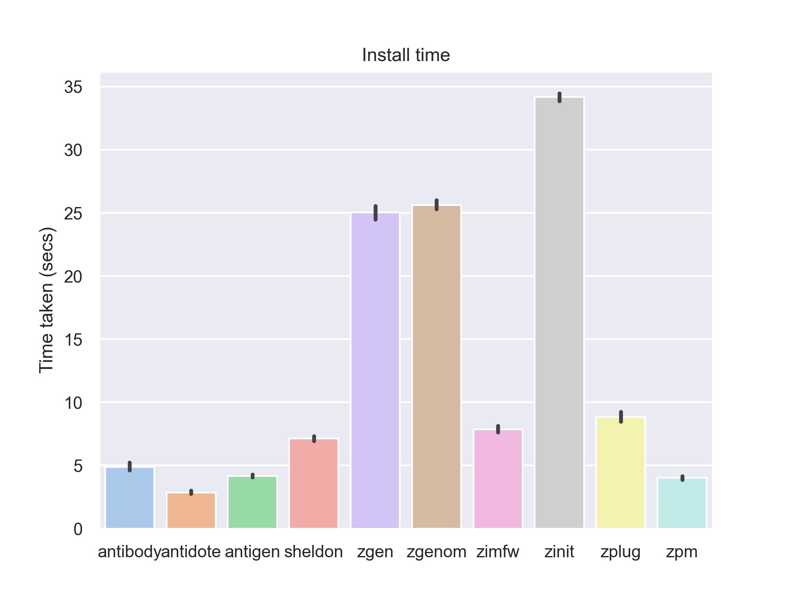

# zsh-plugin-manager-benchmark

Benchmark different Zsh plugin managers.

## Summary

- [antibody<sup>⚠️</sup>][antibody], [antidote],
  [antigen<sup>⚠️</sup>][antigen], [sheldon], [zimfw] all have excellent
  performance in both install time and load time and performance would not be
  a reason to choose one over the other.
- [zgen<sup>⚠️</sup>][zgen] and [zgenom] are on par with the above when it comes
  to load time, but don't seem to do installation in parallel.
- [zinit], [zplug] and [zpm] have notably bad load time performance.

## Introduction

- The following plugin managers are benchmarked:
  - [antibody] v6.1.1 (⚠️ archived)
  - [antidote] v1.9.7
  - [antigen] v2.2.2 (⚠️ unmaintained)
  - [sheldon] v0.8.0
  - [zgen] master @ 0b669d2 (⚠️ unmaintained)
  - [zgenom] main @ ebb37d1
  - [zimfw] v1.16.0
  - [zinit] master @ c346949
  - [zplug] master @ ac6c2a3
  - [zpm] master @ d4173b3
  - *If you would like to add a new plugin manager feel free to open an issue
    and/or pull request.*

- For each plugin manager the *install* time and the *load* time was tested
  - *install* time is the the time taken on the first time loading `~/.zshrc`
    until a prompt appears.
  - *load* time is the time taken for each subsequent load of the `~/.zshrc`
    until a prompt appears.

- 23 of some of the most popular plugins (by GitHub stars) listed in [Awesome
  Zsh Plugins](https://github.com/unixorn/awesome-zsh-plugins/) were used as as
  test case. See [plugins.txt](./src/plugins.txt). The plugins were extracted
  using [awesome-star-count].

- [hyperfine] was used as a benchmarking tool. All benchmarks were run on a
  quiet cloud VM.

- No deferred loading of plugins was done. For example: many plugin managers can
  be used in conjunction with [zsh-defer]. Or [zinit] could be run using `wait`
  which defers the plugin loading until after a prompt.

[awesome-star-count]: https://github.com/rossmacarthur/awesome-star-count
[hyperfine]: https://github.com/sharkdp/hyperfine
[zsh-defer]: https://github.com/romkatv/zsh-defer

[antibody]: https://github.com/getantibody/antibody
[antidote]: https://github.com/mattmc3/antidote
[antigen]: https://github.com/zsh-users/antigen
[sheldon]: https://github.com/rossmacarthur/sheldon
[zgen]: https://github.com/tarjoilija/zgen
[zgenom]: https://github.com/jandamm/zgenom
[zimfw]: https://github.com/zimfw/zimfw
[zinit]: https://github.com/zdharma-continuum/zinit
[zplug]: https://github.com/zplug/zplug
[zpm]: https://github.com/zpm-zsh/zpm

## Results

### Load time


Lower is better. This is the metric we care about most because its the time it
takes to open a new shell until we get a usable prompt.

### Install time



Lower is better. Although install time is not as important as load time it is
probably at least worth doing the install in parallel. From these results its
very clear which plugin managers install in parallel vs sequential. Note:
network jitter can cause some variation in the results for install time.

### Details

#### Host

- Apple M2 Max
- 32 GB RAM
- macOS 15.2
- Docker for Mac v4.38.0
  - Engine: v27.5.1

## Usage

To benchmark the 'install' step run the following.
```sh
./bench.sh install
```

To benchmark the 'load' step run the following.
```sh
./bench.sh load
```

These commands will output results to `results/`. You can then create charts
from these results using the following.

First install Python dependencies.

```
pip install seaborn pandas
```

```sh
./chart.py install
```

or

```sh
./chart.py load
```

## License

This project is distributed under the terms of both the MIT license and the
Apache License (Version 2.0).

See [LICENSE-APACHE](LICENSE-APACHE) and [LICENSE-MIT](LICENSE-MIT) for details.
